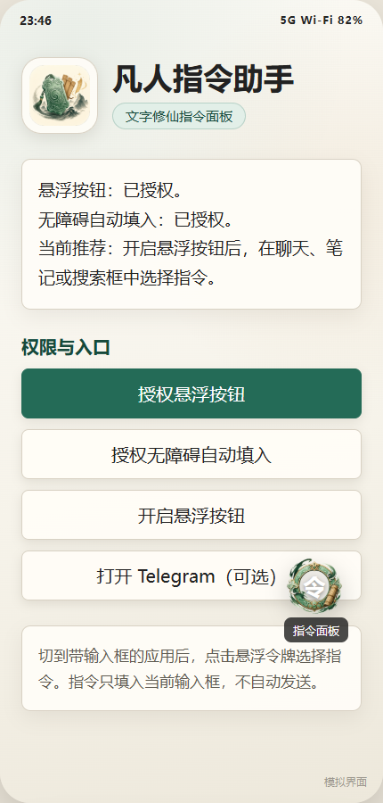
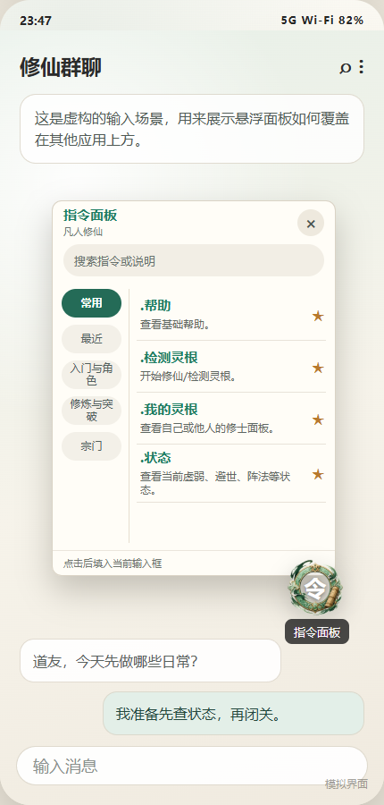

# 凡人指令助手

凡人指令助手是一个 Android 悬浮指令面板，用来在文字修仙群聊、笔记、搜索框等输入场景中快速填入常用游戏指令。

它不是系统键盘，也不会替你自动发送消息。你点选指令后，应用只把指令填入当前输入框，发送前仍由你自己确认。

## 界面预览

以下图片为根据当前实现生成的模拟界面，不含真实聊天、真实账号或真实设备画面。

<p align="center">
  
  
</p>

## 主要功能

- 悬浮令牌：在其他应用上方打开指令面板。
- 指令分类：按常用、最近、入门、修炼、宗门等分类查找。
- 关键字搜索：可以通过指令、说明或分类关键字快速搜索。
- 常用与最近：常用指令和最近使用记录保存在本机。
- 自动填入：开启无障碍后，点击指令会填入当前输入框。
- 剪贴板兜底：找不到可编辑输入框时，会把指令复制到剪贴板。
- 手动发送：应用不会自动提交、发送或点击聊天应用里的发送按钮。

## 安装

1. 从项目发布页或维护者提供的 Release APK 下载应用。
2. 在 Android 设备上安装 APK。如果系统提示来源限制，请允许当前浏览器或文件管理器安装应用。
3. 打开“凡人指令助手”。
4. 点击“授权悬浮按钮”，在系统设置中允许显示悬浮窗。
5. 点击“授权无障碍自动填入”，在系统设置中开启“凡人指令自动填入”。
6. 回到应用，点击“开启悬浮按钮”。

## 使用方法

1. 打开聊天、笔记、搜索框或其他带输入框的应用。
2. 先点一下目标输入框，让光标停在要填入的位置。
3. 点击屏幕边缘的“令”字悬浮令牌。
4. 在指令面板中选择分类，或用搜索框输入关键字。
5. 点击需要的指令。
6. 检查输入框里的内容，确认无误后手动发送或提交。

## 常见问题

**点击指令后会自动发送吗？**

不会。应用只负责填入文本，不会点击发送按钮。

**没开启无障碍还能用吗？**

可以，但不能直接填入当前输入框。点击指令后会复制到剪贴板，你可以手动粘贴。

**为什么需要悬浮窗权限？**

悬浮令牌和指令面板需要显示在其他应用上方。

**为什么需要无障碍权限？**

无障碍服务用于识别当前前台应用里的可编辑输入框，并在你点击指令后填入文本。服务不读取或上传聊天内容。

**命令更新后用户需要改源码吗？**

不需要。普通用户安装新版 Release APK 即可。维护者同步 `ref_doc/fanren-introduce/xiuxian_game_commands.md` 后重新发版，APK 会内置新的指令资料。

## 隐私与权限

- 需要用户手动开启悬浮窗权限和无障碍服务。
- 无障碍服务只在用户点击指令后尝试填入文本。
- 当前版本不声明网络权限，不上传聊天内容或输入内容。
- 指令面板不会自动发送消息。

## 指令资料来源与致谢

项目内 `ref_doc/fanren-introduce` 的指令资料整理自 [iwooji77/fanren](https://github.com/iwooji77/fanren)。感谢原项目整理和维护凡人修仙文字游戏相关资料。

当前目录是为了本项目解析和展示而维护的本地整理快照，不是上游仓库的 Git submodule。本项目尊重原作者及相关权利人的权益；如果这些资料的收录、整理或随 APK 分发存在版权或授权问题，请通过 GitHub Issue 联系维护者，我会及时删除或调整相关内容。

## 从源码构建

项目使用 Android Gradle Plugin。构建前需要安装 JDK 17 或更高版本，并让 `java` 可以通过 `JAVA_HOME` 或 `PATH` 找到。

Android SDK 可以通过 `ANDROID_HOME`、`ANDROID_SDK_ROOT` 或 `local.properties` 指定：

```properties
sdk.dir=<你的 Android SDK 路径>
# 可选：如果没有设置 JAVA_HOME，也可以给项目脚本指定 JDK
java.home=<你的 JDK 路径>
```

构建 Debug APK：

```powershell
.\scripts\build-debug.ps1
```

安装到已连接的 Android 设备：

```powershell
.\scripts\install-debug.ps1
```

构建脚本不会依赖本机固定安装目录；如果你希望自定义 Gradle 缓存位置，可以自行设置 `GRADLE_USER_HOME`。

## 同步上游指令资料

项目提供脚本用于对比上游指令资料更新。默认只显示差异摘要，不改本地文件：

```powershell
.\scripts\sync-ref-doc.ps1
```

需要完整差异时：

```powershell
.\scripts\sync-ref-doc.ps1 -FullDiff
```

确认要用上游文件覆盖本地 `ref_doc` 时，再显式执行：

```powershell
.\scripts\sync-ref-doc.ps1 -Apply
```

`-Apply` 只适合作为重新整理的起点。覆盖后仍需人工校验解析格式、命令分类和本地化调整，再重新构建 APK。

## GitHub Actions 自动构建与发布

项目包含两个 GitHub Actions workflow：

- `Android CI`：推送到 `main`、提交 PR 或手动触发时，运行测试并构建 Debug APK。
- `Android Release`：推送 `v*` 标签或手动输入版本标签时，构建签名 Release APK，并上传到 GitHub Release。

`Android Release` 需要先在仓库的 `Settings` -> `Secrets and variables` -> `Actions` 中配置以下 Secrets：

```text
ANDROID_KEYSTORE_BASE64
ANDROID_KEYSTORE_PASSWORD
ANDROID_KEY_ALIAS
ANDROID_KEY_PASSWORD
```

其中 `ANDROID_KEYSTORE_BASE64` 是 release keystore 文件的 Base64 内容。可以在本机 PowerShell 中生成：

```powershell
[Convert]::ToBase64String([IO.File]::ReadAllBytes("release-keystore.jks")) | Set-Content -NoNewline release-keystore.base64.txt
```

配置好 Secrets 后，推送版本标签即可自动发布：

```powershell
git tag v0.1.0
git push origin v0.1.0
```

也可以在 GitHub Actions 页面手动运行 `Android Release`，并输入类似 `v0.1.0` 的版本标签。

## 许可证

除另有说明外，本项目代码按 [MIT License](LICENSE) 发布。

`ref_doc/fanren-introduce` 是基于上游公开资料整理的指令参考，原始资料来源与权益以 [iwooji77/fanren](https://github.com/iwooji77/fanren) 为准。该目录及由该目录打包进 APK assets 的指令资料不纳入本项目 MIT 授权范围；如相关权利人认为不适合继续公开展示或随 APK 分发，请通过 GitHub Issue 联系维护者删除或调整。

## 致谢

- [LINUX DO 社区](https://linux.do/)
